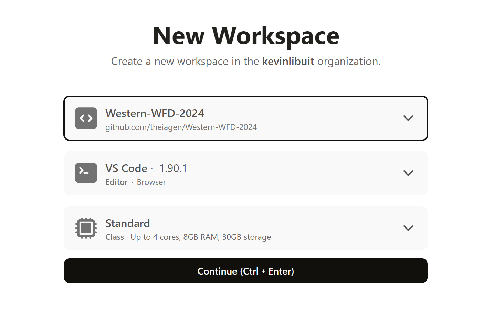
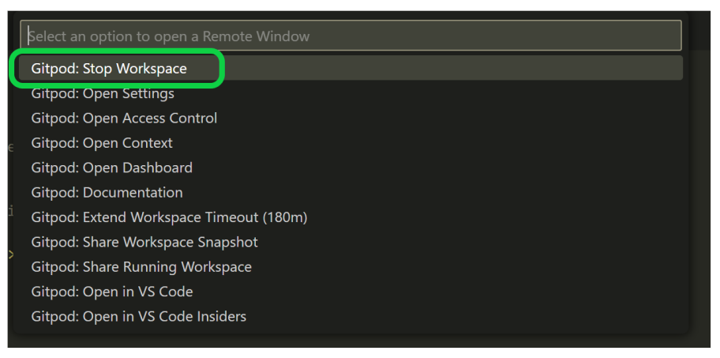
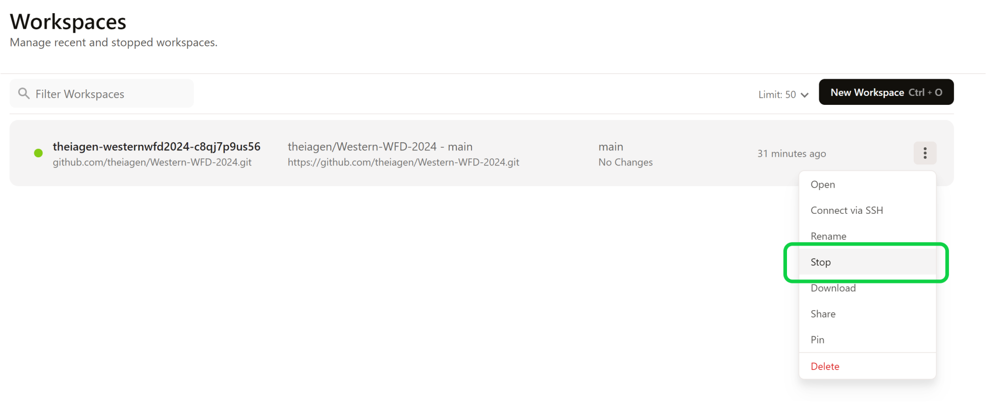

# Software Development Practices for Public Health Bioinformatics
Western Region WFD Offering Provided by the Washington State Department of Health in Collaboration with Theiagen Genomics

## Content
- [Overview](#overview) 
  - [Training Objectives](#training-objectives)
  - [Target Audience](#target-audience)
  - [Course Format](#course-format)
- [Course Content](#course-content)
- [Prerequisites for Hands-On Exercises](#prerequisites-for-hands-on-exercises)

## Overview 
The Washington State Department of Health, in collaboration with Theiagen Genomics, will be hosting an Advanced Bioinformatics Training Workshop throughout July in their role as WFD lead in the Western Region. This will be a virtual workshop hosted on Mondays and Wednesdays via Zoom from **July 8th - 31st, 2024**.

### Training Objectives
- Develop a comprehensive understanding of software development processes and documentation
- Gain comfort in the use of development tools and version control systems for effective code management
- Learn to apply testing and deployment strategies to ensure code quality and stability
- Explore advanced tools and APIs for data management and workflow automation

### Target Audience
This course is designed for bioinformatics scientists interested in strengthening their skill sets as pipeline developers. We aim to cover a comprehensive range of topics, from foundational concepts to advanced techniques, ensuring you gain the knowledge and tools needed to excel in your field. 

Participants should have a strong background in bioinformatics, specifically accessing open-source tools through a command-line interface, running bioinformatics pipelines, and proficiency in at least one scripting language (e.g. Python, Perl, or BASH).  Participants should also have a GitHub account (or an ability to create one) as well as access to a Linux environment within their host institution.

### Course Format 
This will be a 4-week training series occurring on Mondays and Wednesdays from July 8th - 31st, 2024: 
- Mondays (90 min): Lecture material with hands-on exercises
- Wednesdays (60 min): "Office hours" style meeting where participants can ask any questions about the material, and the trainers will address any errors encountered by participants.

All lecture content will be recorded and made available through this GitHub repository to facilitate self-paced and asynchronous learning.

## Course Content

### Slides & Exercises
**Week 01: Design Documents & Development Environments**
- [Lecture Slides](https://github.com/theiagen/Western-WFD-2024/blob/main/slides/slides-w1.pdf)
- [Recording]() -- *Not yet available*
- [Exercise 01: Design Doc, Dev Environment, and Scripting with VSCode](https://github.com/theiagen/Western-WFD-2024/blob/main/exercises/exercise01.md)

**Week 02: Git Fundamentals and Making Source Code Modifications**
- [Lecture Slides](https://github.com/theiagen/Western-WFD-2024/blob/main/slides/slides-w2.pdf)
- [Recording]() -- *Not yet available*
- [Exercise 02: Version Control with Git](https://github.com/theiagen/Western-WFD-2024/blob/main/exercises/exercise02.md)

**Week 03: Bringing Changes into Production**
- [Lecture Slides](https://github.com/theiagen/Western-WFD-2024/blob/main/slides/slides-w3.pdf)
- [Recording]() -- *Not yet available*
- [Exercise 03: GitHub Actions & Static Releases](https://github.com/theiagen/Western-WFD-2024/blob/main/exercises/exercise03.md)
  
**Week 04: Advanced Usage of Terra**
- [Lecture Slides](https://github.com/theiagen/Western-WFD-2024/blob/main/slides/slides-w4.pdf)
- [Recording]() -- *Not yet available*

## Prerequisites for Hands-On Exercises
In addition to lectures, this course consists of several hands-on exercises to reinforce the coursework material. To participate in these exercises, trainees will need the following resources: 

### GitHub Account
If you don't already have a GitHub account, please go to github.com and register (it's free!)
  - Once you have registered, ensure you are signed into your account on github.com

### GitPod Account 
- Navigate to https://gitpod.io/
- Select "Continue with GitHub", authorize Gitpod to access your GitHub account, and sign in with your credentials

### GitPod Configuration for Public Repositories
Once registered, navigate to your User Settings to enable write access to public repositories:
- User Settings can be accessed by clicking your profile photo in the upper right hand corner

  

  - Select Git Providers

  

  - Then select the three verticle dots on the right of the GitHub section and select "Edit Permissions"

  

  - From the Edit Permissions menu, check "public_repo", then click "Update Permissions"

  

### GitPod Workspace
  - Navigate to your Workspaces tab and select New Workspace

  

  - Set the repository to https://github.com/theiagen/Western-WFD-2024/
  - Select the default Editor and default Class, click "Continue"

  

 

🚨**NOTE**🚨 Once you're finished working, make sure to shut down your workspace to save your allotted free hours (50hr/month) in GitPod. There are a few ways to stop your workspace from running:
- In GitPod environment (VSCode interface), click on the orange Gidpod in bottom left corner. Select "Stop Workspace"

  

- Navigate to https://gitpod.io/, find your workspace in the list, click on the three-dot button, and select "Stop" 

  

