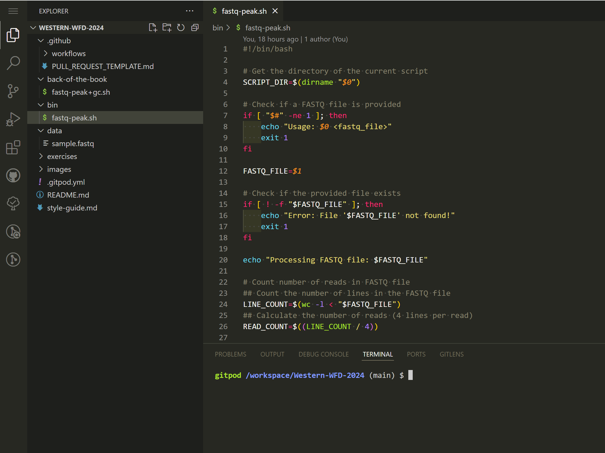
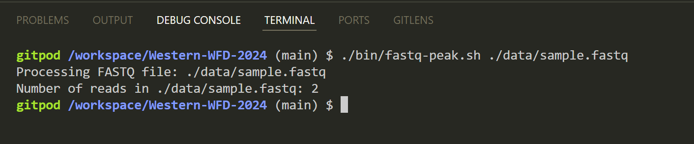

# Exercise 1: Design Doc, Dev Environment, and Scripting with VSCode

1. Assess our Design Doc to gain an thorough understanding of our project's **Problem Statement**, **Objectives**, **Proposed Solution**, and **Implementation Plan**.

2. Use GitPod to create a dev environment:
    -    Navigate to https://gitpod.io/
    - Select "Continue with GitHub", authorize Gitpod to access your GitHub account, and sign in with your credentials
    - Start New Workspace
    - Set the "Context URL": https://github.com/theiagen/Western-WFD-2024/
    - Select the default Editor and default Class, click "Continue"
  

  

3. Familiarize yourself with the VSCode environment

  

4. Assess the [fastq-peak.sh](https://github.com/theiagen/Western-WFD-2024/blob/main/bin/fastq-peak.sh)` software and test it using the [benchmark read data](https://github.com/theiagen/Western-WFD-2024/blob/main/data/sample.fastq)

  

5. Begin modiffying [fastq-peak.sh](https://github.com/theiagen/Western-WFD-2024/blob/main/bin/fastq-peak.sh) to calculate `GC_COUNT`, `TOTAL_BASE_COUNT`, & `GC_PERCENT`; report `GC_PERCENT` to `stdout`
    - Test your solutions using the [benchmark read data](https://github.com/theiagen/Western-WFD-2024/blob/main/data/sample.fastq)
      - Calculated GC Content for this input fastq file should equal 50%
    - Be sure to adhere to the [repository style guide](https://github.com/theiagen/Western-WFD-2024/blob/main/style-guide.md) when modifying [fastq-peak.sh](https://github.com/theiagen/Western-WFD-2024/blob/main/bin/fastq-peak.sh)

7. Save your changes within your workspace

8. Once you're finished working, make sure to shut down your workspace to save your allotted free hours (50hr/month) in GitPod. There are a few ways to stop your workspace from running:
    - In GitPod environment (VSCode interface), click on the orange Gidpod in bottom left corner. Select "Stop Workspace"
    - Navigate to https://gitpod.io/, find your workspace in the list, click on the three-dot button, and select "Stop"

 
 Exercise 1 Solution
 
    

A modified fastq-peak.sh code with gc-count calculation and reporting can be found in the [back of the book](https://github.com/theiagen/Western-WFD-2024/blob/main/back-of-the-book/fastq-peak%2Bgc.sh).

