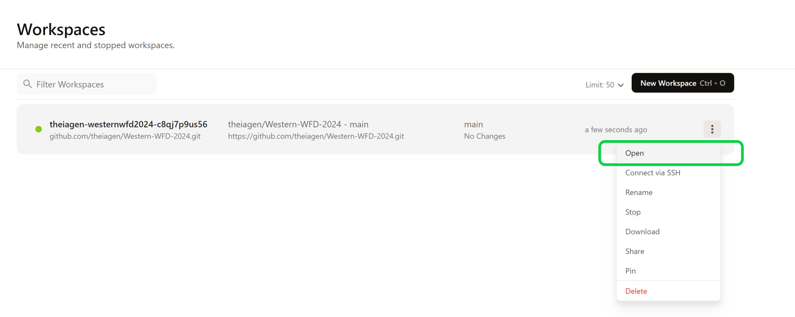
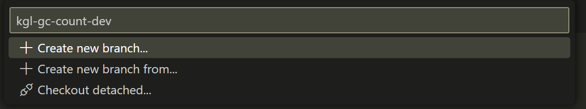
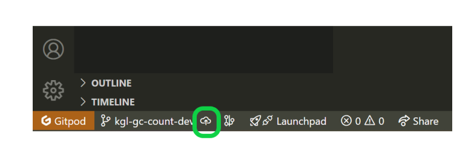
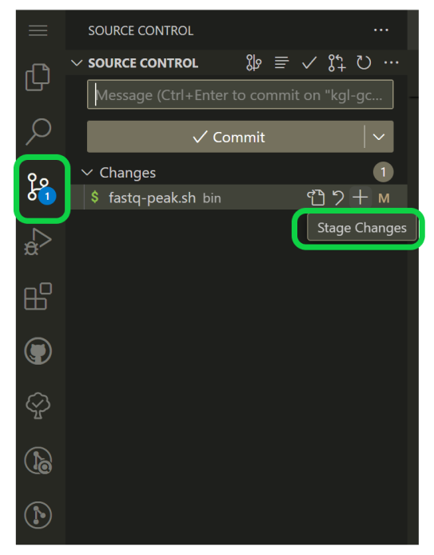
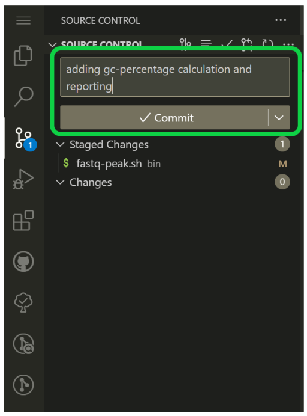
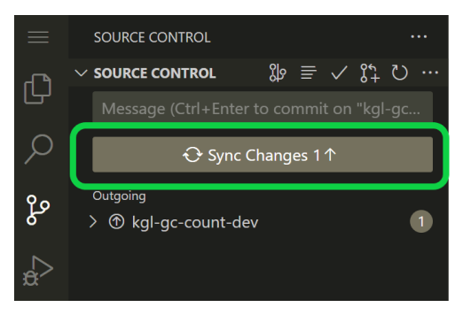
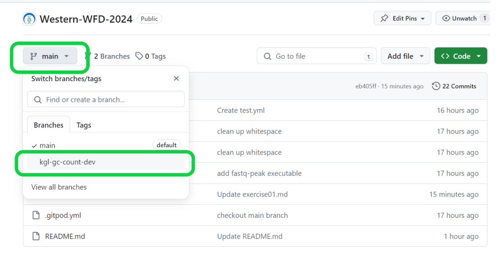
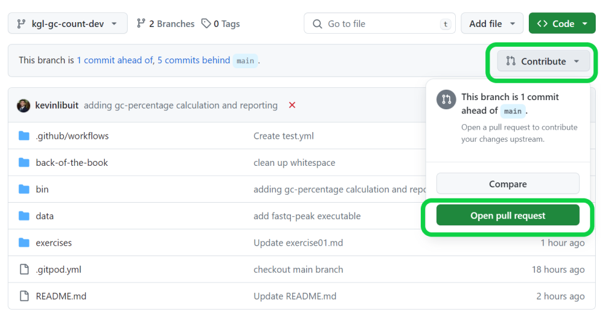
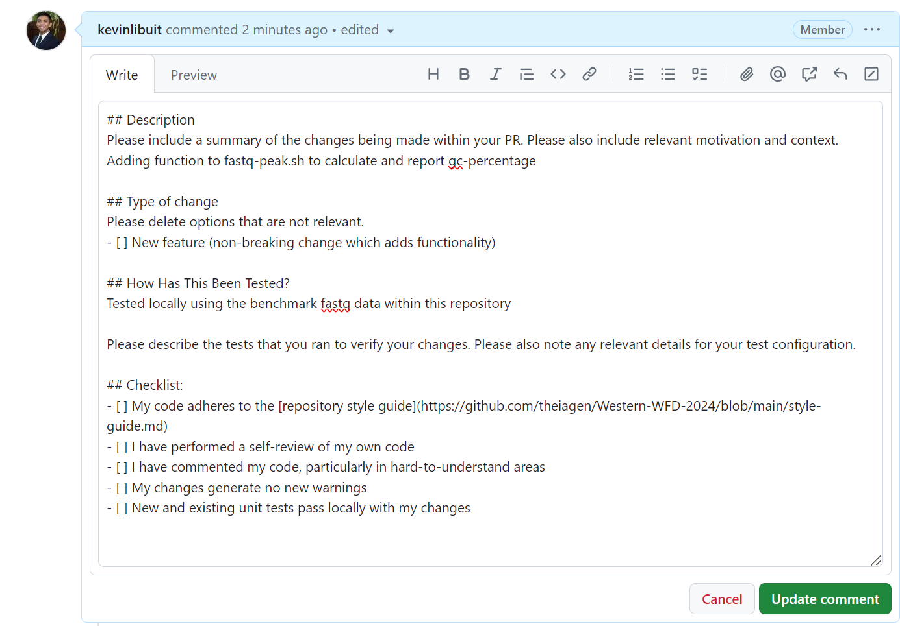

# Exercise 02: Version Control with Git
## Creating a dev branch and stagging/committing changes
1. Access your dev environment through GitPod:
    -    Navigate to https://gitpod.io/
    - Select "Continue with GitHub", authorize Gitpod to access your GitHub account, and sign in with your credentials
    - Select your existing workspace from Week 1
       - Select the three verticle dots on the right-hand side of your workspace and select "Open"

  

2. Currently, you should be working within the main branch of this repo, but this is a protected branch to which we cannot commit direcly. Instead, a dev branch must be created and PR issued to push changes to main. To do this:
    - Use VSCode to create a dev branch by clicking "main" in the bottom left corner, naming your branch in the text box that appears (e.g. `kgl-gc-count-dev`) and selecting "Create new branch".

  

    - Click the push icon in the bottom-left corner of your VSCode interface to publish this branch to the remote repository.

  

3. From your newly created dev branch, use the VSCode interface to stage the changes you made to `fastq-peak.sh` which add the gc-percentage calculation and reporting.

  

4. Commit these changes with a comment, e.g. `adding gc-percentage calculation and reporting`.

  

5. Use the Sync Changes button that appears to publish this branch to the remote repository.

  

## Openning a Pull Request
1. Navigate to the remote repository on GitHub and select your dev branch

  

2. Use the "Contribute" dropdown menu to open a pull request

  

3. Complete the PR form for this repository and create the pull request

  

**Note:** Check-list items can be selected by adding an `X` between the brackets in markdown, e.g. `[X]`, or after the PR is created using the web interface.
