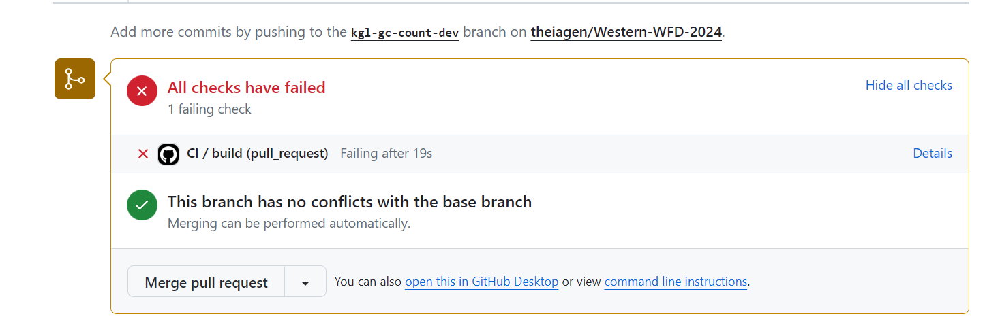
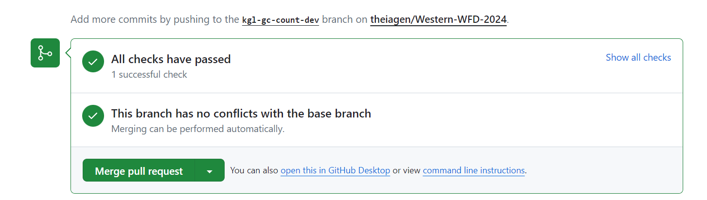

# Exercise 03: GitHub Actions & Static Releases

## GitHub Actions

1. Navigate to the [.github/workflows/test.yml](https://github.com/theiagen/Western-WFD-2024/blob/main/.github/workflows/test.yml) file to understand the automated tests implemented for this repository.
    - Based on this file, consider if the changes we made to add gc-calculation and reporting to fastq-peek.sh would pass this test.
    
2. Navigate to the pull request made in the [Week 2 Exercise](https://github.com/theiagen/Western-WFD-2024/blob/main/exercises/exercise02.md) and see if these changes pass the automated test defined in [.github/workflows/test.yml](https://github.com/theiagen/Western-WFD-2024/blob/main/.github/workflows/test.yml)
    - If the checks have failed, click "Details" to investigate further.

<p align="center">
  
</p>

3. Propose solutions to resolve these failed tests and implement your proposed solution on your dev branch.

    - **NOTE**: Workflow files within GitHub require elevated authentication to modify. If you're using a personal access token (PAT), ensure that you have the required workflow scope to modify files in the [.github/workflows/](https://github.com/theiagen/Western-WFD-2024/blob/main/.github/workflows/) directory. Otherwise, you may encounter the following error ```Tried to add this file and got : > git push origin main:main
To https://github.com/theiagen/Western-WFD-2024.git
 ! [remote rejected] main -> main (refusing to allow an OAuth App to create or update workflow .github/workflows/test.yml without workflow scope)
error: failed to push some refs to 'https://github.com/theiagen/Western-WFD-2024.git'```

    - **Solution**: Generate a new PAT with the necessary scopes (`repo` and `workflow`).
       - Go to GitHub and generate a new token with `repo` and `workflow` scopes.
       - First, from github.com, click on your profile photo in the upper-right hand corner and clieck Settings from the drop down menu
       - {IMAGE}
       - From Settings, select "Developer Spaces" on the bottom of the left-hand menu.
       - {IMAGE}
       - Click the "Personal access token" drop down and select "Tokens (clasic)"
       - Select "Generate new token (classic)" and ensure the "workflow" scope is selected and then click "Generate token" at the bottom of the screen.
       - {IMAGE}
       - Update your Git remote URL to use the new token:

       ```bash
       git remote set-url origin https://<your-token>@github.com/theiagen/Western-WFD-2024.git
       ```

       - Replace `<your-token>` with your new PAT.

4. Commit any changes you've made to resolve these issues. If done correctly, you should see that all automated checks now pass:

<p align="center">
  
</p>

5. Once this PR is merged, as a group, we will make a version release with our new code changes!

<details>
 <summary> Exercise 3 Solution
 </summary><br/>

A modified test.yml file to account for gc-count reporting can be found in the [back of the book](https://github.com/theiagen/Western-WFD-2024/blob/main/back-of-the-book/test-gc.yml).

</details>
